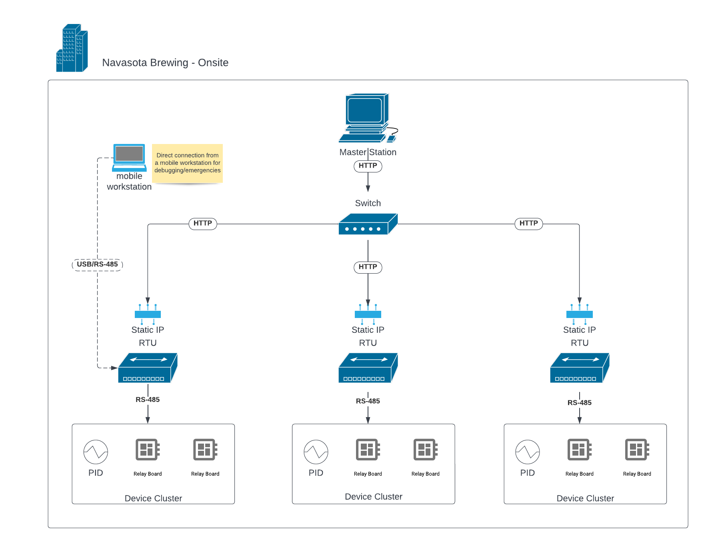

# Architecture

This document is a high level overview of the architecture of both the software and hardware used by the Navasota Brewing Company in our "Brewery Control System". It describes how the hardware is laid out, and how the software operates.

# The Network/Hardware

This shows the physical layout of the BCS.

1. A "master station". This acts at the "master" in the master/slave paradigm along with the RTUs. It is the high arbiter of the entire system. It will host the web interface server, which communicates with the RTUs through HTTP.

2. Multiple RTUs (remote terminal units). RTUs can be any machine that can connect to the network and communicate through serial ports. We use the Raspberry Pi 3B+ because it's cheap and effective. These are embedded within the brewing hardware, physically connected to devices. They are on the same network as the master station, and they are controlled by it. Each RTU is sensibly placed within the building to control nearby devices.

3. Device clusters. Devices are pieces of hardware that are controlled by a controller. These controllers are what are connected to the RTU computer. A controller may host 1 or more devices. For instance, a PID controller may host a thermometer device, while a relay board controller may host 8 or 16 relay controlled devices.

## 1. The Master Station
The master station is a workstation that runs a local server which talks to all the RTUs. The master station acts as the "master" to all the RTUs. The RTUs can never initiate communication: they can be polled or commanded by the master station.

## 2. RTUs
RTUs are small computers that command devices. We use the Raspberry Pi 3B/3B+ because of the cost.

RTUs are generally enclosed in cases that we specifically design for each purpose. For instance, we have a plastic waterproof box that holds an RTU, relay board, and Omega CN7500. We have waterproof ports cut in the side to plug our valves and thermometers in. The build of an RTU will vary greatly for each use case.

RTUs need to be configured before use. Each RTU will have a configuration file that tells the software where on the RS-485 network the controllers live, and what devices are hosted by each controller. This config file should be written at RTU setup, and modified when the hardware configuration changes.

See the [guides section](Setup%20Guides/readme.md) on setting up RTUs.

## 3. Device Clusters
Device clusters are devices grouped by RTU. Because they almost always need to be physically connected, it makes sense to group device by proximity, not type or purpose.

We try to stick to the Modbus RTU protocol for consistency, but we'll take what we can get. The STR1XX relay board, for example, just communicates through raw RS-485. A custom driver or interface is written for each type of device.

See the [hardware pages](Hardware/README.md) for guides on each type of device.

# The Software
The software packages have a similar layout to the hardware.

1. [`NavasotaBrewing/starscourge`](https://github.com/NavasotaBrewing/starscourge) at the top level is the web interface that the brewer uses. It runs on the master station mentioned above, and communicates with the RTUs through HTTP.
2. [`NavasotaBrewing/iris`](https://github.com/NavasotaBrewing/iris) The RTU API, which is the other half of the HTTP coin. The RTU API (`iris`) and master station (`starscourge`) are meant to speak with one another. The RTU API runs on each RTU.
3. [`NavasotaBrewing/cli`](https://github.com/NavasotaBrewing/cli) provides a CLI that also runs on the RTUs. This is for manual intervention in case of emergencies or if the network breaks. It will give you full control over the devices, directly from the RTU. This can be accomplished through an SSH connections from the master station, or direct USB/RS-485 connection if the network is down.
4. [`NavasotaBrewing/brewdrivers`](https://github.com/NavasotaBrewing/brewdrivers) A library of drivers providing control over the hardware. This is used by the above packages, but does not need any setup on the RTU.

All software packages run on the same global configuration file, [specified here](Software/RTU%20Configuration/Configuration%20Files.md).

## Full Repository List
Here's a list of all the repositories in the organization. The ones named above are the core packages that make the beer brew.

| Repository | Description |
| ---------- | ----------- |
| [`NavasotaBrewing/documentation`](https://github.com/NavasotaBrewing/documentation) | where you are now. Just documentation and guides. |
| [`NavasotaBrewing/brewdrivers`](https://github.com/NavasotaBrewing/brewdrivers) | a library (Rust crate) of interfaces and drivers for interacting with hardware. Is not used directly by the brewer, but can be used for scripting if necessary. |
| [`NavasotaBrewing/cli`](https://github.com/NavasotaBrewing/cli) | A CLI built on top of `brewdrivers`. This lets you control each device directly. It's good when the whole system isn't running or in emergency situations. Every RTU will be configured (through it's config file) to work with the CLI, so you can connect directly (SSH/Physical) through a mobile workstation to control the hardware |
| [`NavasotaBrewing/starscourge`](https://github.com/NavasotaBrewing/starscourge) | A VueJS based web interface. This is what the master station runs, and it polls/controls the RTUs. This is the intended interface for the whole system. |
| [`NavasotaBrewing/iris`](https://github.com/NavasotaBrewing/iris) | A network package (Rust crate) that runs on the RTU, exposing an HTTP interface for controlling the hardware. This is what `starscourge` talks to when it sends requests to the RTUs. |
| [`NavasotaBrewing/brewkit`](https://github.com/NavasotaBrewing/brewkit) | Deprecated. The predecessor of `starscourge`. |
| [`NavasotaBrewing/network`](https://github.com/NavasotaBrewing/network) | Deprecated. The predecessor of `iris`. |
| [`NavasotaBrewing/docker`](https://github.com/NavasotaBrewing/docker) | Deprecated. We don't use these anymore. |

