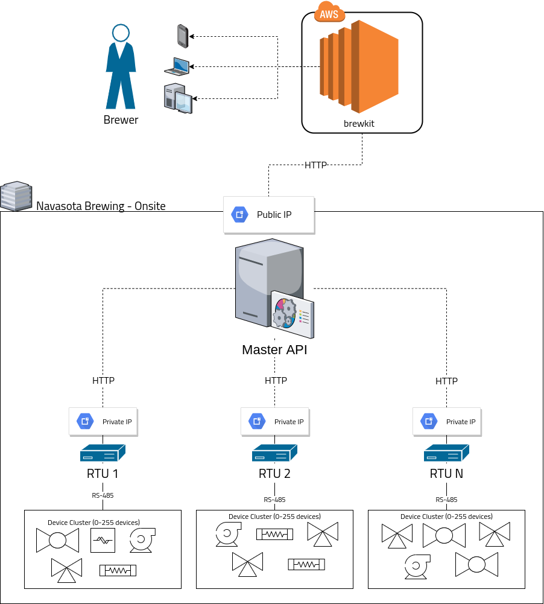
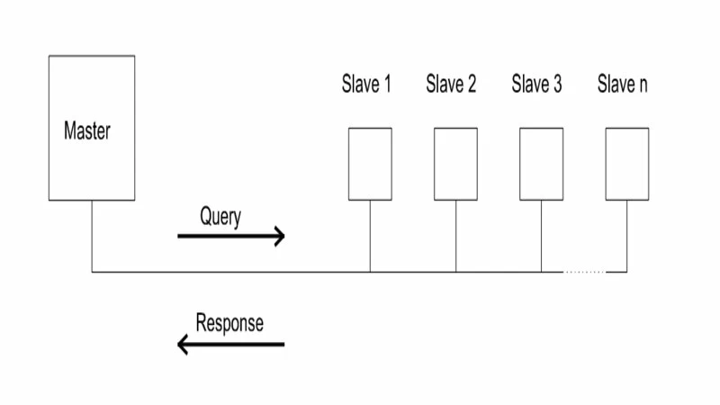

# Architecture

This document is a high level overview of the architecture of both the software and hardware used by the Navasota Brewing Company. It describes how the hardware is laid out, and how the software communicates.

For package-specific documentation, see each repository under the [`NavasotaBrewing`](https://github.com/NavasotaBrewing) Github account.

## Birds Eye View

The main features of the Navasota Brewing layout are

1. The web front end, served offsite by AWS EC2.
2. The master API, run onsite with a static, public IP
3. 1 or more "RTUs" (remote terminal units), which use the Modbus RS-485 protocol to control...
4. device clusters.

# Code Maps
See each repository for more documentation.

| Repository | Description |
| ---------- | ----------- |
| [`NavasotaBrewing/readme`](https://github.com/NavasotaBrewing/readme) | where you are now. Just documentation. |
| [`NavasotaBrewing/brewdrivers`](https://github.com/NavasotaBrewing/brewdrivers) | a library (Rust crate) of interfaces and drivers for interacting with hardware. Is not used directly by the brewer, but can be used for scripting if necessary. This is the brain of the entire system. |
| [`NavasotaBrewing/cli`](https://github.com/NavasotaBrewing/cli) | A CLI built on top of `brewdrivers`. This lets you directly control devices from each RTU. Every RTU will have it installed, so you only need to connect (SSH/Physical) to the RTU and run the CLI. |
| [`NavasotaBrewing/network`](https://github.com/NavasotaBrewing/network) | another Rust crate containing web servers to run on both the RTUs and master station. This handles all communication between any wireless/network device in the system. If it's not talking through a serial wire, it's this packages job. |
| [`NavasotaBrewing/brewkit`](https://github.com/NavasotaBrewing/brewkit) | A VueJS front end; the primary tool the brewer uses to control the BCS. It runs somewhere (local/AWS/wherever) and communicates with the master station. |
| [`NavasotaBrewing/docker`](https://github.com/NavasotaBrewing/docker) | Hosts our docker configuration files. There's not much there right now. |

# BCS Layout
This section describes each element of the BCS at a high level.

## Brewkit
Brewers interact directly with [`NavasotaBrewing/brewkit`](https://github.com/NavasotaBrewing/brewkit), which is a VueJS front end. It is served offsite through Amazon EC2 so that it's accessible anywhere. 

> **Note**: While we're still in development, `brewkit` is being served from a local workstation, not EC2. This does not change the layout significantly.

Using `brewkit`, the user will create a "configuration" (a model of the device clusters), which is used to send instructions to the devices via the RTUs.

## Master API
The master API, served from the "master station", is the point of contact between the external EC2 server described above and the RTUs. It is the master in the master/slave paradigm. It either sends instructions to or polls the RTUs for state. 

The master API accepts the configuration mentioned above from `brewkit`, which it then sends to every RTU. The RTUs determine the device state changes that need to be made, or update the sent configuration with device state.

This API is part of [`NavasotaBrewing/network`](https://github.com/NavasotaBrewing/network).

## RTUs
RTUs are discrete computers (Raspberry Pis, in our case) that command a device cluster. They are primarily operated through HTTP requests sent by the master API from the master station. However, devices can be controlled through a CLI provided directly by the RTU for manual override or emergency purposes.

The RTU communicates with devices through a Modbus RS485 network

Here, the "master" is the RTU and the "slaves" are each device in the cluster.

Per the limitations of the Modbus protocol, a cluster can have 0-247 devices. This is not a severe limitation, as device clusters typically consist of only 2-15 devices, depending on scale.

Clusters are meant to be small. Because the RTU has to be physically connected to the devices, it makes sense to cluster devices depending on proximity.

At Navasota Brewing Company, we use a homemade, waterproof box to hold our RTUs. Inside, we store the raspberry pi itself, as well as things like relay boards, PID sensors, solid state relays, and others. The design of this box changes depending on the device cluster.

The RTUs communicate with the master API through HTTP. We use a wireless connection so the RTUs don't have to be physically connected to the master station, but a wired connection could be supported with proper brewery layout.

## Device clusters
Device clusters vary widely between clusters. There is a variety of devices we use at Navasota Brewing, and we're working on expanding the list. A few examples:

 * `STR1160000H` relay board
   * Provided by [smarthardware.eu](https://www.smarthardware.eu)
   * Has an array of electric relays that can be used to switch many devices, like electric ball valves and pumps. This is a workhorse for us.
 * `Omega CN7500` 
   * Provided by [OMEGA Engineering](https://www.omega.com/en-us/)
   * Used to sense temperature in a liquid and pulse a heater to maintain temperature

Cluster setup is very dependant on devices. See the [hardware page](./hardware.md) for more information about the devices.
