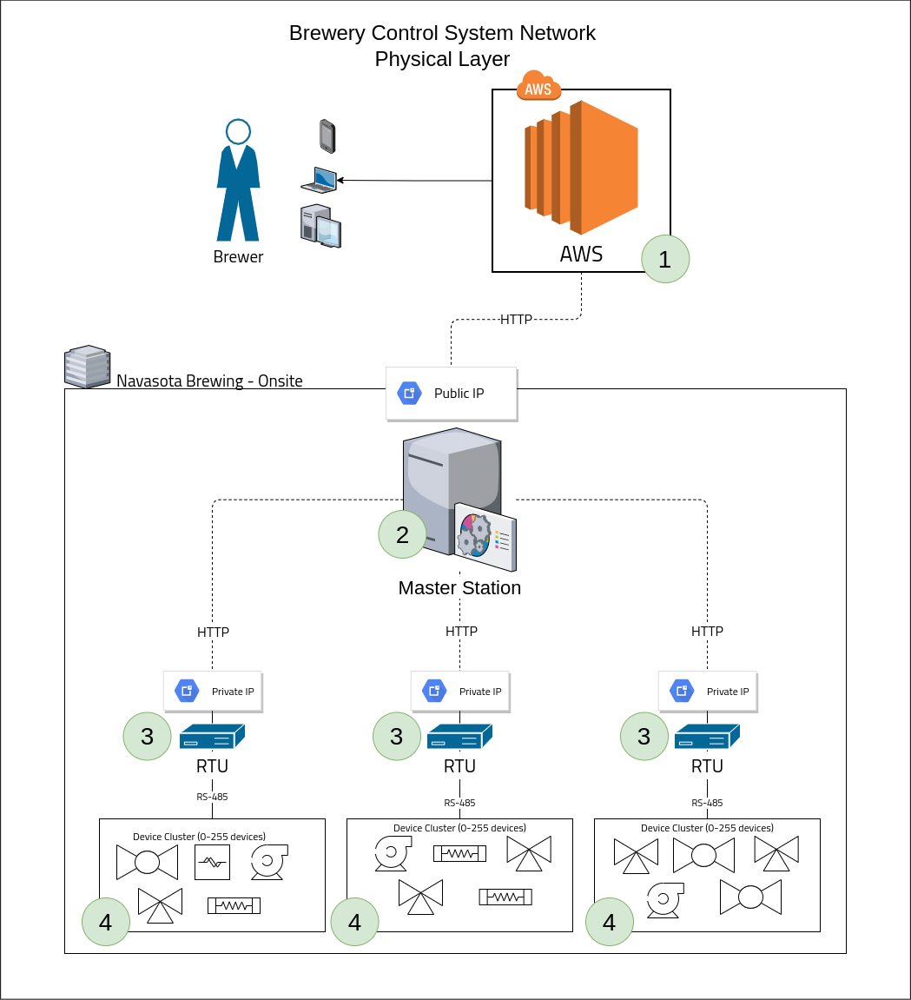
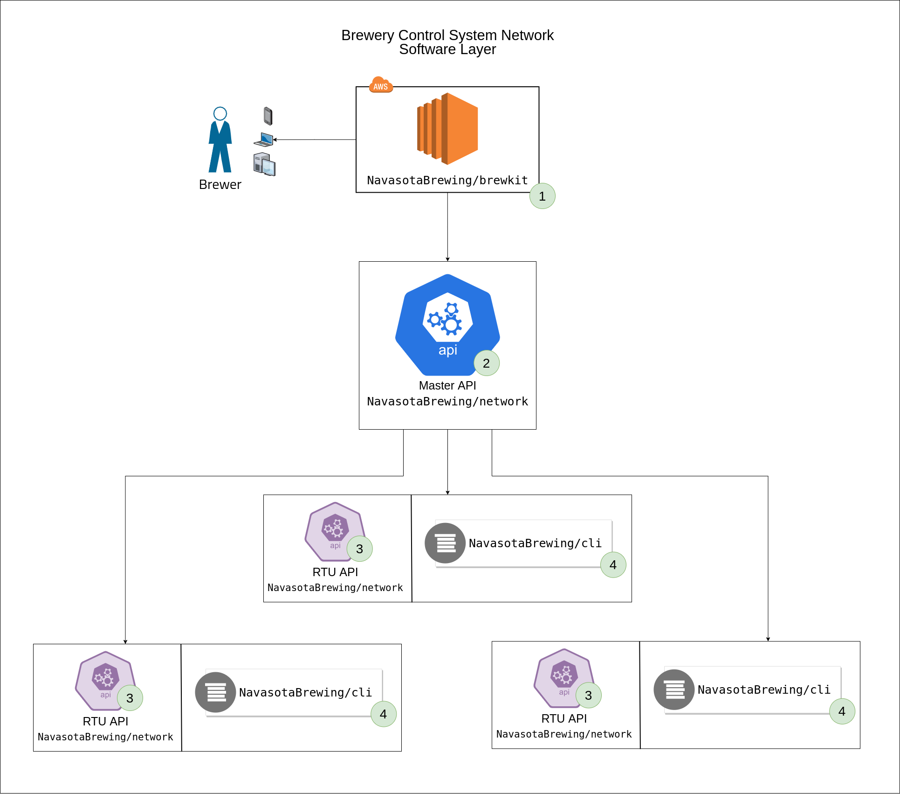

Warning: We've changed the architecture a bit so this information is a little outdated. Stay tuned for updated information.
<!-- TODO: Update this document -->

# Architecture

This document is a high level overview of the architecture of both the software and hardware used by the Navasota Brewing Company in our "Brewery Control System". It describes how the hardware is laid out, and how the software operates.

# The Network/Hardware

This shows the physical layout of the BCS.

1. An Amazon AWS instance that handles all public webservers and interfaces provided by the software. 

  
2. A "master station", on premises. This acts at the "master" in the master/slave paradigm along with the RTUs. It is the high arbiter of the entire system.
   
3. Multiple RTUs (remote terminal units). RTUs can be any machine that can connect to the network and communicate through serial ports. We use the Raspberry Pi 3B+ because it's cheap and effective. These are embedded within the brewing hardware, physically connected to devices. They are on the same network as the master station, and they are controlled by it. Each RTU is sensibly placed within the building to control nearby devices.

4. Device clusters. These devices are things like pumps, valves, PID, themometers, float sensors, burners, scales, etc. Anything that can affect the BCS or collect data is considered a device. These devices are connected to the RTUs (usually physically). There is practically no limit to the number of devices in a cluster (247 due to Modbus RTU limitation, unless they don't use Modbus RTU).

## 1. AWS
We use a web-based interface to control the BCS. This is hosted by Amazon AWS.

> Note: During development, we are not yet using AWS. Instead, any software that belongs there is just being run on a local webserver. This doesn't significantly affect the network.

This web interface sends frequent requests to the master station, which then determines the actions to take.

## 2. The Master Station
The master station is a local server which talks to all the RTUs. If needed, the master station can also run the software that runs in AWS, eliminating the need for an external server and keeping the entire system local (this is what we're doing in development).

The master station acts as the "master" to all the RTUs. The RTUs can never initiate communication: they can be polled or commanded by the master station. 

## 3. RTUs
RTUs are small computers that command devices. We use the Raspberry Pi 3B/3B+ because of the cost.

The RTUs need to be configured to communicate with the devices and the master station. A number of software packages need to be installed, and some configuration options set. See the [hardware pages](hardware/readme.md) for a guide on setting up RTUs.

RTUs are generally enclosed in cases that we specifically design for each purpose. For instance, we have a plastic waterproof box that holds an RTU, relay board, and Omega CN7500. We have waterproof ports cut in the side to plug our valves and thermometers in. The build of an RTU will vary greatly for each use case.

## 4. Device Clusters
Device clusters are devices grouped by RTU. Because they almost always need to be physically connected, it makes sense to group device by proximity, not type or purpose.

We try to stick to the Modbus RTU protocol for consistency, but we'll take what we can get. The STR1XX relay board, for example, just communicates through raw RS485. A custom driver or interface is written for each type of device.

See the [hardware pages](hardware/readme.md) for guides on each type of device.

# The Software

The software packages have a similar layout to the hardware.

1. [`NavasotaBrewing/brewkit`](https://github.com/NavasotaBrewing/brewkit) at the top level is the web interface that the brewer uses. It runs on the AWS server mentioned above.
2. [`NavasotaBrewing/network`](https://github.com/NavasotaBrewing/network) contains the Master API, which is analogous to the master station. It is the arbiter of all the RTUs.
3. [`NavasotaBrewing/network`](https://github.com/NavasotaBrewing/network) also contains the RTU API, which is the other half of the API coin. The RTU and Master APIs are meant to speak with one another, with the RTU recieving commands and providing the Master API with state information, which is then sent back to the AWS server. The RTU API runs on each RTU (3 are pictured here, there could be more/less).
4. [`NavasotaBrewing/cli`](https://github.com/NavasotaBrewing/cli) provides a CLI that also runs on the RTUs. This is for manual intervention in case of emergencies or if the network breaks. It will give you full (and sometimes more) control over the devices, directly from the RTU. 

## Full Repository List
Here's a list of all the repositories in the organization. The ones named above are the core packages that make the beer brew.

| Repository | Description |
| ---------- | ----------- |
| [`NavasotaBrewing/readme`](https://github.com/NavasotaBrewing/readme) | where you are now. Just documentation. |
| [`NavasotaBrewing/brewdrivers`](https://github.com/NavasotaBrewing/brewdrivers) | a library (Rust crate) of interfaces and drivers for interacting with hardware. Is not used directly by the brewer, but can be used for scripting if necessary. This is the brain of the entire system. |
| [`NavasotaBrewing/cli`](https://github.com/NavasotaBrewing/cli) | A CLI built on top of `brewdrivers`. This lets you directly control devices from each RTU. Every RTU will have it installed, so you only need to connect (SSH/Physical) to the RTU and run the CLI. |
| [`NavasotaBrewing/network`](https://github.com/NavasotaBrewing/network) | another Rust crate containing web servers to run on both the RTUs and master station. This handles all communication between any wireless/network device in the system. If it's not talking through a serial wire, it's this packages job. |
| [`NavasotaBrewing/brewkit`](https://github.com/NavasotaBrewing/brewkit) | A VueJS front end; the primary tool the brewer uses to control the BCS. It runs somewhere (local/AWS/wherever) and communicates with the master station. |
| [`NavasotaBrewing/docker`](https://github.com/NavasotaBrewing/docker) | Hosts our docker configuration files. There's not much there right now. |

